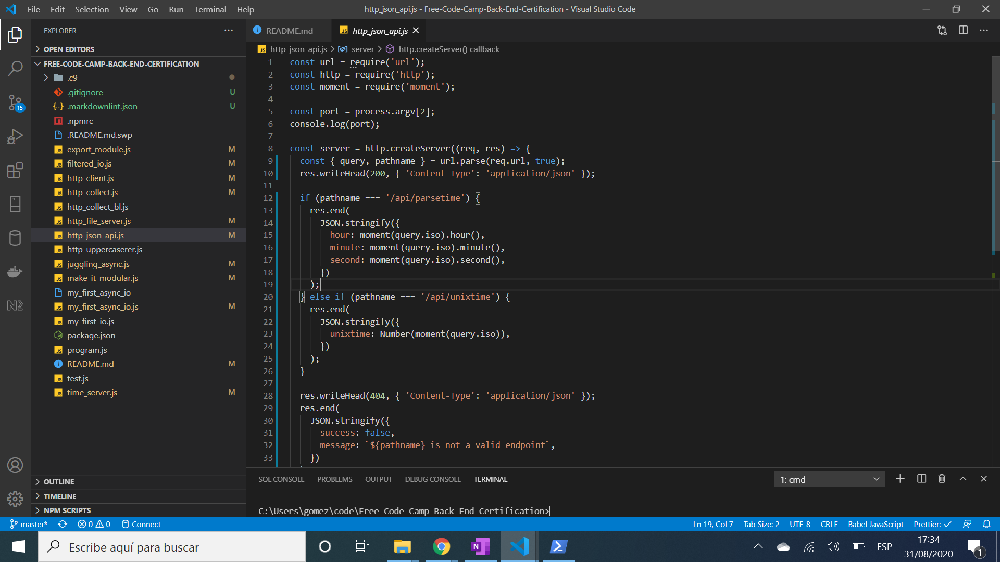

# :zap: Node.js Exercises

* Completed javascript exercises from freeCodeCamp to learn about http requests and related call-back functions
* **Note:** to open web links in a new window use: _ctrl+click on link_


## :page_facing_up: Table of contents

* [:zap: Node.js Exercises](#zap-nodejs-exercises)
	* [:page_facing_up: Table of contents](#page_facing_up-table-of-contents)
	* [:camera: Screenshots](#camera-screenshots)
	* [:signal_strength: Technologies](#signal_strength-technologies)
	* [:floppy_disk: Setup](#floppy_disk-setup)
	* [:computer: Code Examples](#computer-code-examples)
	* [:clipboard: Status & To-Do List](#clipboard-status--to-do-list)
	* [:clap: Inspiration](#clap-inspiration)
	* [:envelope: Contact](#envelope-contact)

## :camera: Screenshots

.

## :signal_strength: Technologies

* [moment v2](https://www.npmjs.com/package/moment) npm module to parse, validate, manipulate and format dates.
* [bl v4](https://www.npmjs.com/package/bl) buffer list; a storage object for collections of Node Buffers
* [UTF-8](https://en.wikipedia.org/wiki/UTF-8) variable-width character encoding (As of August 2020, UTF-8 accounts for 95.4% of all web pages)
* [through2-map](https://www.npmjs.com/package/through2-map) uses array map function on data streams (chunks)

## :floppy_disk: Setup

* Setup is not applicable. These javascript files were run inside a c9 backend challenges boilerplate

## :computer: Code Examples

* extract from `my_first_async_io.js` to parse contents of a `utf8` file using the file system module 'readFile'

```javascript
const fs = require('fs'); //loads the fs module from node.js

fs.readFile(process.argv[2], 'utf8', (err, string) => {
	if (err) return console.error(err);
	const result = string.split('\n').length - 1;
	console.log(result);
}); //returns contents of file

/*notes:
utf8 is 1 to 4 8-bit bytes of binary data
*/
```

## :clipboard: Status & To-Do List

* Status: Working
* To-Do: nothing

## :clap: Inspiration

* [freeCodeCamp: curriculum](https://www.freecodecamp.org/learn) although these exercises are no longer included

## :envelope: Contact

* Repo created by [ABateman](https://github.com/AndrewJBateman), email: gomezbateman@yahoo.com
